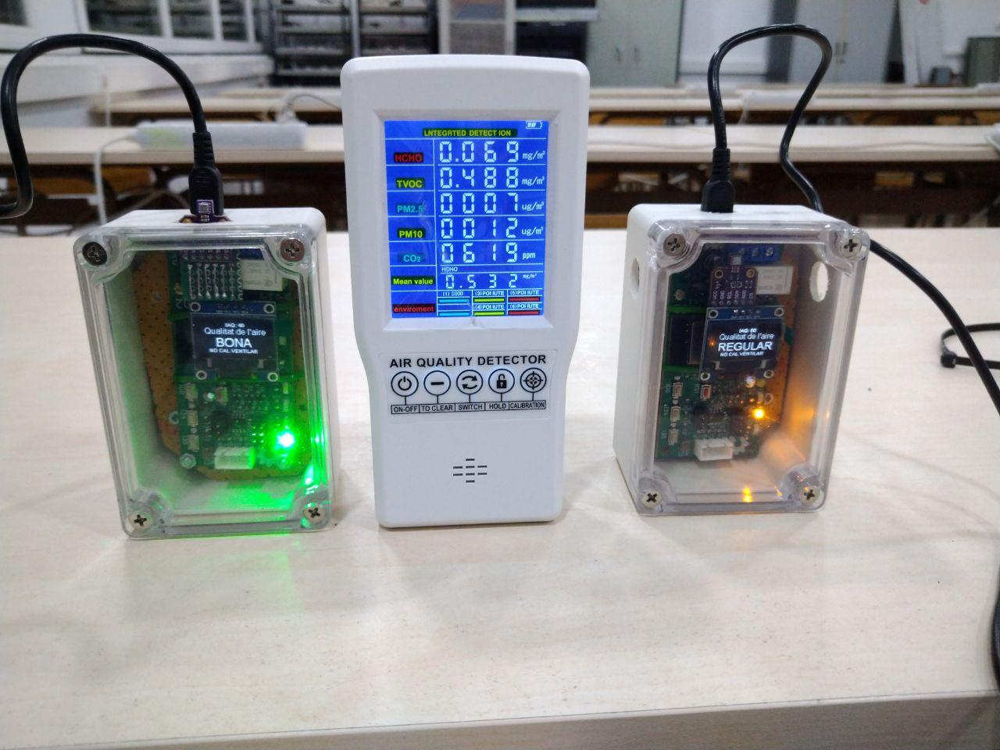

# Ventilation Meter for Preventing COVID-19

## System description

The device consists of a lightweight box with an internal display that shows the air quality. Energy is supplied with an standard cell phone microUSB 5V DC source.
The sensor is connected to a Telegram bot that let users to interact with it, for instance to know the air quality from outside the classroom or remotely.

### Based on IoT-02 board

The project is based on the open source board IoT-02 (https://github.com/jordibinefa/IoT-02)

